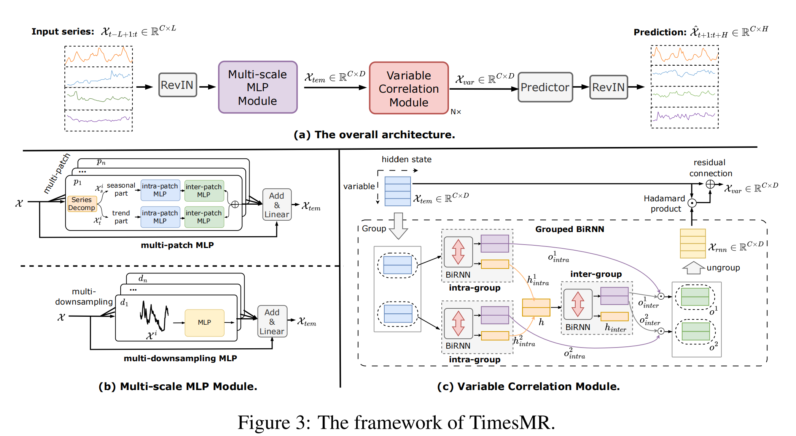
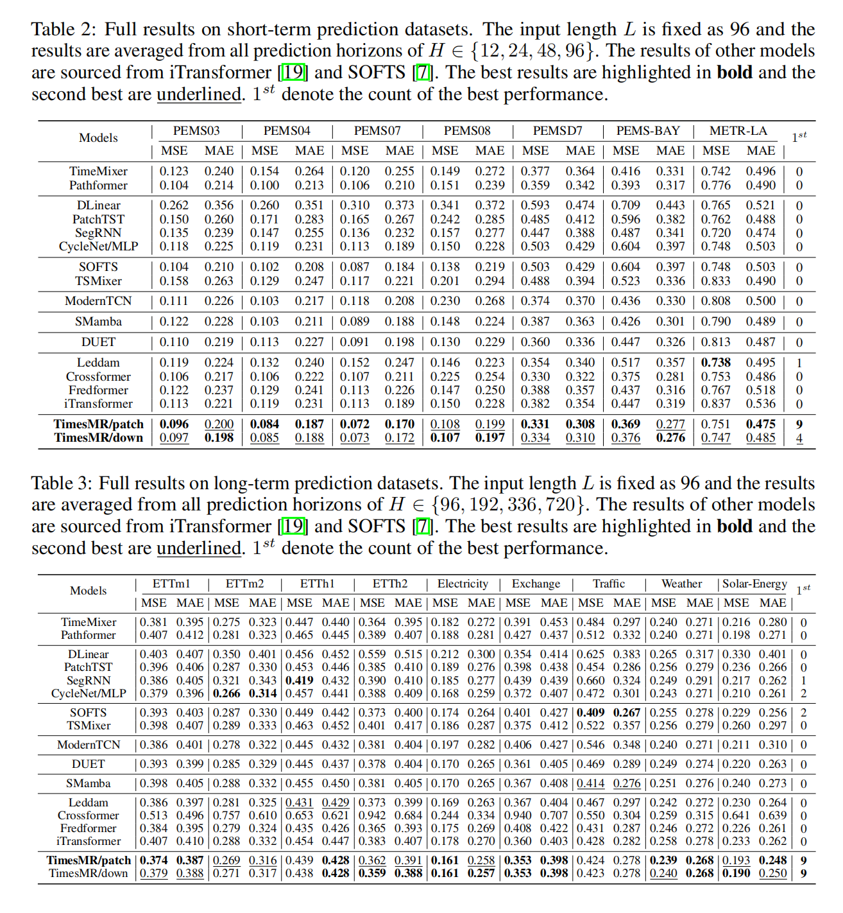

# TimesMR
Code release of paper "TimesMR: Unlocking the Potential of MLP and RNNs for Multivariate Time Series Forecasting"

## 1 Get Started

1.1 Install Python 3.8
```
pip install -r requirements.txt
```

1.2 Data. All benchmark datasets can be obtained from [Google Drive](https://drive.google.com/drive/folders/13Cg1KYOlzM5C7K8gK8NfC-F3EYxkM3D2). All datasets should be placed under folder `./dataset`, such as `./dataset/electricity/electricity.csv`.
1.3 You can reproduce the experiment results as the following examples
```
# TimesMR/patch
sh patch.sh

# TimesMR/down
sh down.sh
```

## 2 Architecture
### 2.1 The architecture of TimesMR is as follows, including the ovreall architecture, the Multi-scale MLP module and Variable Correlation module. 
<div align="center"> 
  
</div>


### 2.2 The performance of TimesMR is as follows. We compare TimesMR with 15 baselines on 16 popular datasets. TimesMR can achieve consistent SOTA performance.
<div align="center"> 
  
</div>

