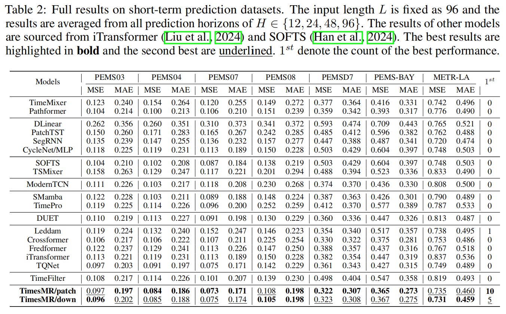
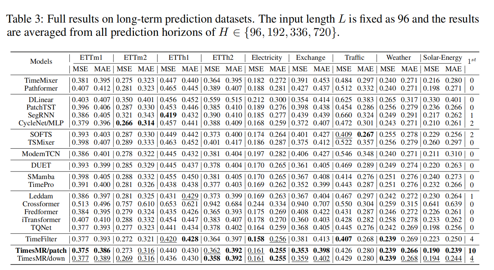
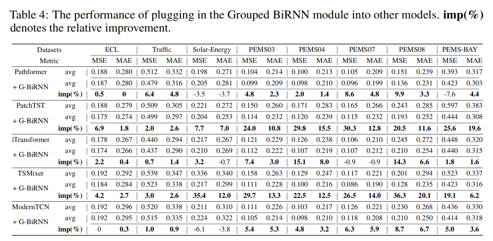

# TimesMR
Code release of paper "TimesMR: Unlocking the Potential of MLP and RNNs for Multivariate Time Series Forecasting"

## Get Started

1. Install Python 3.8
```
pip install -r requirements.txt
```

2. Data. All benchmark datasets can be obtained from [Google Drive](https://drive.google.com/file/d/1MKugRwUKN2u9tIBgES-n3-QOT5l6unLl/view?usp=drive_link). All datasets should be placed under folder `./dataset`, such as `./dataset/electricity/electricity.csv`.

3. You can reproduce the experiment results as the following examples
```
# TimesMR/patch
sh patch.sh

# TimesMR/down
sh down.sh
```

## Architecture
The architecture of TimesMR is as follows, including the ovreall architecture, the Multi-scale MLP module to capture temporal dependency and Variable Correlation module to explore the variable relationship. 
<div align="center"> 
  
</div>

## Experiments
### Main results
The performance of TimesMR is as follows. We compare TimesMR with 15 baselines on 16 popular datasets. TimesMR can achieve consistent SOTA performance.
<div align="center"> 
  
</div>
<div align="center"> 
  
</div>

### Analysis of Multi-scale MLP module
We integrate our Multi-scale MLP module into other models and report their performance. The results demonstrate that both the Patch and Down modules significantly enhance the performance of all selected models.
<div align="center"> 
  
</div>

### Analysis of Variable Correlation module
We integrate our Variable Correlation (Grouped BiRNN) module into other models and report their performance. The results highlight the versatility of Grouped BiRNN as a plug-and-play module that effectively facilitates information exchange among variables, thereby enhancing their representations.
<div align="center"> 
  
</div>
